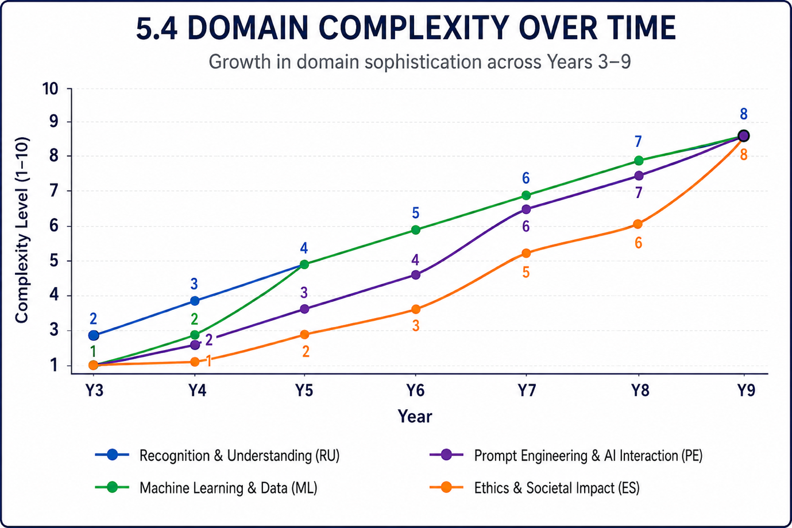
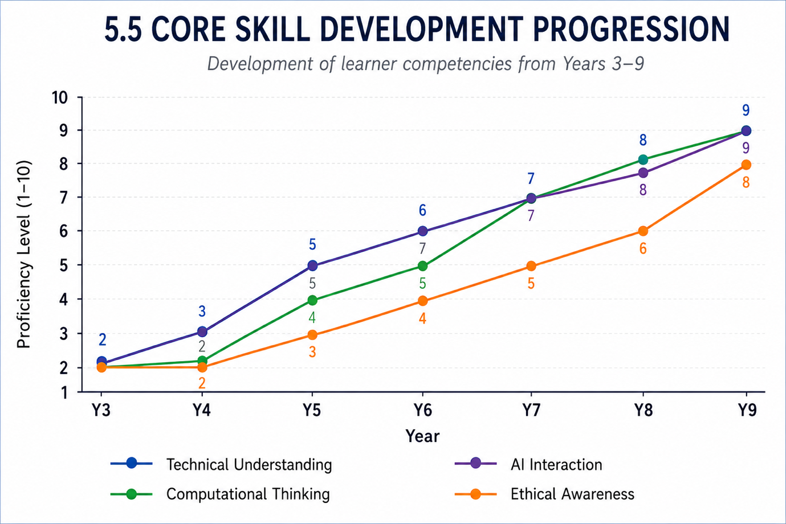
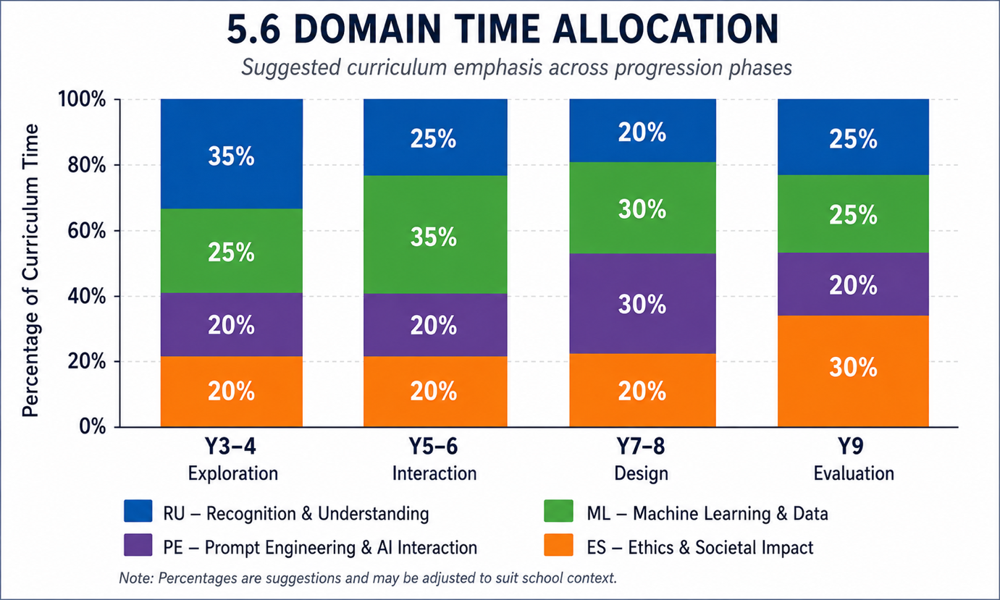
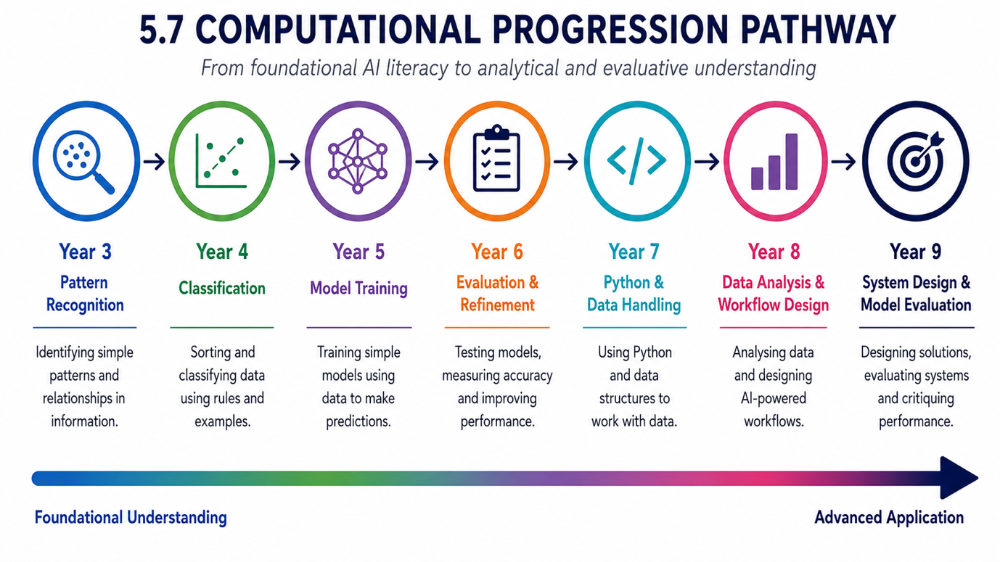

# Curriculum Progression

## 5.1 Progression Philosophy

Progression within the curriculum is based on the principle that
learners should move beyond recognising AI technologies towards
understanding, evaluating, and eventually designing AI-supported
solutions.

Rather than viewing progression as the accumulation of isolated
knowledge, the framework emphasises the development of increasingly
sophisticated ways of thinking about AI systems.

Learners progress from:

Recognition → Interaction → Design → Evaluation

This progression reflects both cognitive development and increasing
technical complexity.

## 5.2 Progression Stages

| Stage       | Years     | Characteristics                       |
|-------------|-----------|---------------------------------------|
| Exploration | Years 3–4 | Recognition, observation, description |
| Interaction | Years 5–6 | Testing, training, refinement         |
| Design      | Years 7–8 | Structuring, developing, analysing    |
| Evaluation  | Year 9    | Critiquing, improving, reflecting     |

## 5.3 Curriculum Progression Overview

| Year | Big Idea                                                           | Computational Focus                      | Final Project                |
|------|--------------------------------------------------------------------|------------------------------------------|------------------------------|
| Y3   | AI is all around us and responds to information.                   | Pattern recognition and logical thinking | AI in Everyday Life Showcase |
| Y4   | AI learns patterns and makes predictions.                          | Classification and decision-making logic | AI Classification System     |
| Y5   | AI systems learn from data and can be trained.                     | Structured thinking and model training   | Basic AI Model               |
| Y6   | AI systems can be evaluated, improved, and refined.                | Testing, evaluation, and iteration       | AI Evaluation Project        |
| Y7   | AI systems are designed to solve specific problems.                | Introductory Python and data handling    | AI-Powered Solution          |
| Y8   | AI can be applied to real-world challenges and decisions.          | Data analysis and workflow design        | Real-World AI Workflow       |
| Y9   | AI systems must be critically evaluated and responsibly developed. | System design and model evaluation       | Independent AI Investigation |

## 5.4 Domain Complexity Over Time

This visual demonstrates how each domain increases in complexity
throughout the curriculum.

## 5.5 Core Skill Development Progression

This visual demonstrates the development of key learner competencies
across the curriculum.

## 5.6 Domain Time Allocation

This visual illustrates how emphasis shifts across the curriculum
phases.

## 5.7 Computational Progression Pathway

This pathway demonstrates how learners move from foundational AI
literacy towards analytical and evaluative understanding.

| **Phase** | **Primary Focus**                  |
|-----------|------------------------------------|
| Year 3    | Pattern Recognition                |
| Year 4    | Classification                     |
| Year 5    | Model Training                     |
| Year 6    | Evaluation and Refinement          |
| Year 7    | Python and Data Handling           |
| Year 8    | Data Analysis and Workflow Design  |
| Year 9    | System Design and Model Evaluation |

# Domain Progression Maps

## Introduction

The curriculum is organised around four interconnected domains that
collectively support the development of AI literacy, computational
thinking, ethical awareness, and practical problem-solving.

Each domain follows a structured progression pathway from Years 3–9,
enabling learners to revisit and deepen key concepts while developing
increasingly sophisticated understanding and skills.

The progression maps below illustrate how learning develops across each
domain and provide a clear overview of expected learner development
throughout the curriculum.

## 6.1 AI Recognition & Understanding (RU)

### Domain Overview

The AI Recognition & Understanding domain develops learners’ conceptual
understanding of artificial intelligence systems.

Learners explore how AI systems operate, how they process information,
how they differ from traditional rule-based technologies, and how they
are applied in real-world contexts.

Progression begins with recognising AI technologies encountered in
everyday life and gradually advances towards analysing system
architecture, evaluating limitations, and understanding the broader
implications of intelligent systems.

By Year 9, learners should be capable of critically evaluating how AI
systems are designed, deployed, and applied.

### Progression Matrix

| **Year** | **Progression Focus**                                                                      |
|----------|--------------------------------------------------------------------------------------------|
| Year 3   | Recognise AI technologies in everyday life and distinguish AI from non-AI systems.         |
| Year 4   | Explain how AI systems use inputs, outputs, and pattern recognition.                       |
| Year 5   | Understand how AI systems use data to generate responses and predictions.                  |
| Year 6   | Explain how AI systems are trained, tested, and improved through feedback.                 |
| Year 7   | Analyse the structure and workflow of AI systems using model-input-output frameworks.      |
| Year 8   | Evaluate how AI systems operate across different real-world applications and environments. |
| Year 9   | Critically analyse advanced AI systems, capabilities, limitations, and risks.              |

### Key Development Milestones

#### Years 3–4

Learners develop awareness of AI technologies and begin recognising how
intelligent systems interact with information.

#### Years 5–6

Learners develop understanding of how AI systems learn from data and
improve performance.

#### Years 7–8

Learners analyse system design and investigate how AI is implemented in
real-world contexts.

#### Year 9

Learners critically evaluate AI systems and their limitations from
technical and societal perspectives.

## 6.2 Machine Learning & Data (ML)

### Domain Overview

The Machine Learning & Data domain develops learners’ understanding of
how AI systems use data to identify patterns, make predictions, and
improve performance.

Learners investigate the role of datasets, classification, training,
testing, and evaluation while developing increasingly sophisticated data
literacy and analytical skills.

The domain provides a practical foundation for understanding modern AI
technologies while supporting future progression into computing, data
science, and machine learning.

### Progression Matrix

| **Year** | **Progression Focus**                                                                |
|----------|--------------------------------------------------------------------------------------|
| Year 3   | Identify patterns, similarities, and categories within simple datasets.              |
| Year 4   | Classify information and test simple AI classification models.                       |
| Year 5   | Train and test basic machine learning models using labelled data.                    |
| Year 6   | Measure model accuracy and improve performance through dataset refinement.           |
| Year 7   | Prepare structured datasets and compare model performance.                           |
| Year 8   | Analyse variables affecting model reliability and performance.                       |
| Year 9   | Evaluate datasets, testing methodologies, and simplified machine learning workflows. |

### Key Development Milestones

#### Years 3–4

Learners develop foundational understanding of patterns, classification,
and data organisation.

#### Years 5–6

Learners begin training, testing, and evaluating machine learning
models.

#### Years 7–8

Learners investigate data quality, performance factors, and analytical
processes.

#### Year 9

Learners evaluate machine learning systems and understand simplified
model-development workflows.

## 6.3 Prompt Engineering & AI Interaction (PE)

### Domain Overview

The Prompt Engineering & AI Interaction domain develops learners’
ability to communicate effectively with AI systems.

Learners explore how instructions influence AI-generated outputs and
develop increasingly sophisticated approaches to prompting, refinement,
evaluation, and AI-assisted problem-solving.

The domain supports both practical AI literacy and future readiness by
helping learners develop effective interaction strategies for a rapidly
evolving AI landscape.

### Progression Matrix

| **Year** | **Progression Focus**                                                                   |
|----------|-----------------------------------------------------------------------------------------|
| Year 3   | Provide simple instructions to AI systems and observe responses.                        |
| Year 4   | Refine prompts and explore how wording influences outputs.                              |
| Year 5   | Design prompts to achieve specific goals and outcomes.                                  |
| Year 6   | Iteratively improve prompts based on feedback and results.                              |
| Year 7   | Create structured and multi-step prompts for specific tasks.                            |
| Year 8   | Develop AI-assisted workflows using increasingly complex prompt structures.             |
| Year 9   | Apply advanced prompting strategies to support investigation, creation, and evaluation. |

### Key Development Milestones

#### Years 3–4

Learners develop awareness of how AI systems respond to different
inputs.

#### Years 5–6

Learners learn to refine and improve prompts strategically.

#### Years 7–8

Learners use structured prompting to support research, planning, and
problem-solving.

#### Year 9

Learners evaluate and optimise prompt strategies for complex tasks and
workflows.

## 6.4 Ethics & Societal Impact (ES)

### Domain Overview

The Ethics & Societal Impact domain develops learners’ understanding of
the responsibilities associated with the development and use of AI
technologies.

Ethical understanding is embedded throughout the curriculum and
progresses alongside technical development.

Learners investigate fairness, bias, privacy, accountability,
intellectual property, misinformation, and the broader societal
implications of AI.

The domain supports the development of informed, responsible, and
reflective digital citizens.

### Progression Matrix

| **Year** | **Progression Focus**                                                                     |
|----------|-------------------------------------------------------------------------------------------|
| Year 3   | Recognise safe and responsible use of AI technologies.                                    |
| Year 4   | Explore fairness and accuracy in AI-generated outputs.                                    |
| Year 5   | Understand how data quality and bias can influence AI systems.                            |
| Year 6   | Evaluate fairness, reliability, and ethical considerations in AI systems.                 |
| Year 7   | Investigate privacy, misinformation, and responsible AI use.                              |
| Year 8   | Analyse intellectual property, ownership, and societal impacts of AI technologies.        |
| Year 9   | Evaluate governance, accountability, future implications, and responsible AI development. |

### Key Development Milestones

#### Years 3–4

Learners develop awareness of responsible and safe AI use.

#### Years 5–6

Learners explore fairness, bias, and reliability in AI systems.

#### Years 7–8

Learners investigate broader ethical and societal issues associated with
AI technologies.

#### Year 9

Learners critically evaluate the future impact and governance of AI
systems.

